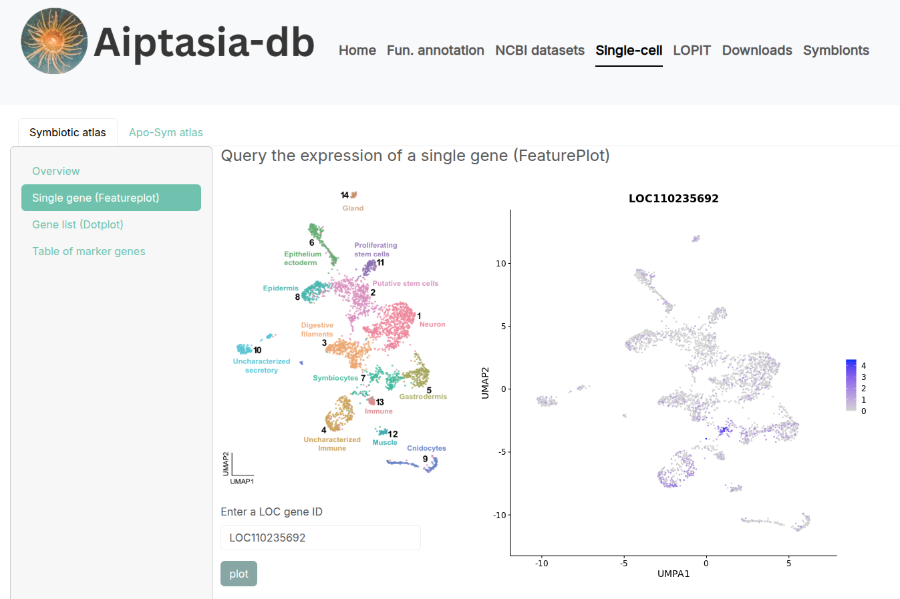

A Shiny web application to explore the sequencing resources available for the sea anemone Aiptasia (Exaiptasia diaphana), the model organism to study coral-dinoflagellate endosymbiosis.
An instance of this app is hosted at www.aiptasia-db.org   
To run this application from local download the tar.gz packaged version that contains the code and data.   

